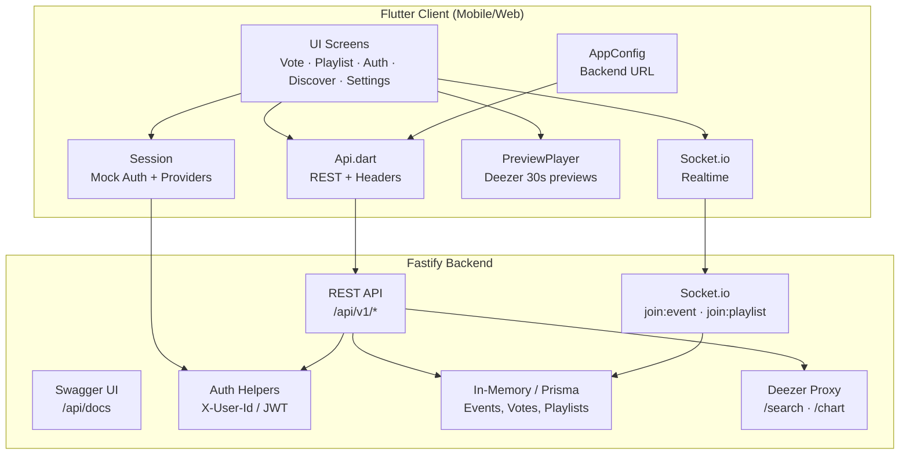
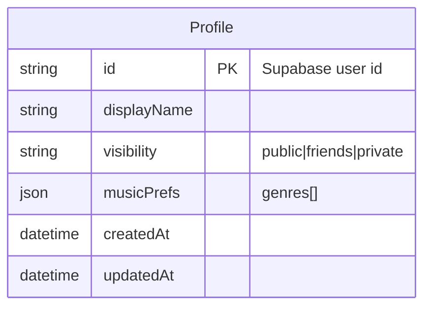
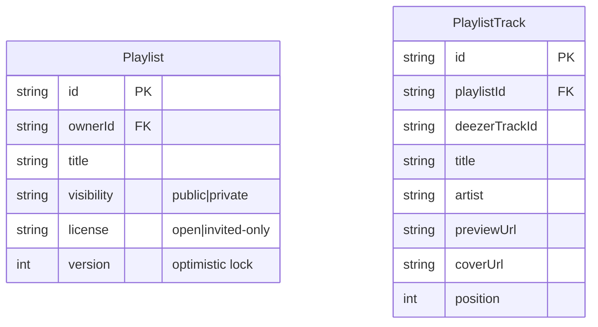
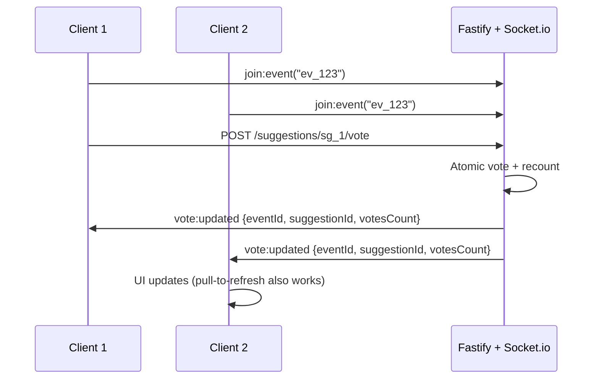
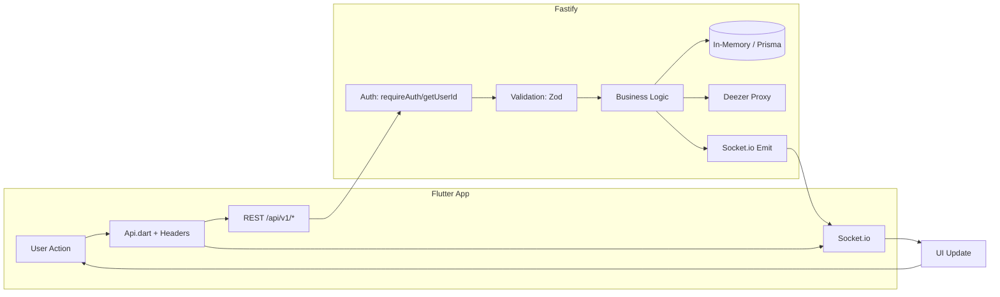
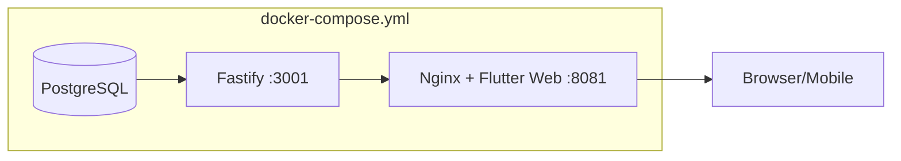

# Music Room — Implemented Features

> Source of truth: `music.pdf` (42 Music Room v6)  
> Stack: **Flutter** (mobile/web) + **Fastify** (backend) + **PostgreSQL/Prisma** (prod)  
> Deezer API: metadata/preview only — voting, ranking, realtime are ours

---

## Architecture Overview



---

## 1. Authentication & Profile (V.1)

### Backend
| Endpoint | Method | Description |
|----------|--------|-------------|
| `/api/v1/profile` | GET | Get own profile (displayName, visibility, musicPrefs) |
| `/api/v1/profile` | PUT | Update profile (displayName, visibility: public/friends/private, musicPrefs.genres[]) |

### Mobile
- **Sign in**: Email/password (mock, 6+ chars), Google, Facebook
- **Link providers** post-signup (password + social on same account)
- **Forgot password** flow (demo: shows snackbar)
- **Profile editor**: displayName, visibility dropdown, favorite genres (comma-separated)
- **Session persistence** via `SharedPreferences` (token, email, providers[])
- **Sign out** clears local session

### Data Model


---

## 2. Live Vote Queue / Events (V.2.1)

### Backend
| Endpoint | Method | Description |
|----------|--------|-------------|
| `/api/v1/events` | POST | Create event (title, visibility, license, geo/timebox) |
| `/api/v1/events` | GET | List events (public + invited private) |
| `/api/v1/events/:id/suggest` | POST | Suggest track (Deezer metadata) |
| `/api/v1/events/:id/queue` | GET | Ranked queue (votesCount desc, tie-break by id) |
| `/api/v1/suggestions/:id/vote` | POST | **Atomic vote** (unique user+suggestion, recount, realtime emit) |
| `/api/v1/events/:id/invites` | POST/GET | Owner-only invite management |

### License Types (Vote)
| License | Who Can Vote |
|---------|--------------|
| `open` | Anyone with access |
| `invited-only` | Owner + invited users |
| `geofenced` | Inside radius + time window (lat/lon/radiusM/startAt/endAt) |

### Concurrency Safety
- **Atomic vote**: `unique(suggestionId, userId)` + recount in single critical section
- **Realtime**: Socket.io `vote:updated` broadcast to `event:{id}` room
- **No last-write-wins** — vote count always recalculated from source

### Mobile Screens
- **VoteScreen**: Event list + top tracks carousel (Deezer chart), create event FAB
- **EventForm**: Title, visibility, license, geofence fields (lat/lon/radius/start/end)
- **EventDetail**: Live queue with rank badges, vote buttons, suggest FAB, invite section
- **SuggestForm**: Search Deezer or browse chart, pick track → suggest to event

### Data Model
```mermaid
erDiagram
    Event {
        string id PK
        string ownerId FK
        string title
        string visibility "public|private"
        string license "open|invited-only|geofenced"
        float lat
        float lon
        int radiusM
        datetime startAt
        datetime endAt
    }
    TrackSuggestion {
        string id PK
        string eventId FK
        string deezerTrackId
        string title
        string artist
        string previewUrl
        string coverUrl
        int votesCount
    }
    Vote {
        string id PK
        string suggestionId FK
        string userId
        datetime createdAt
        unique(suggestionId, userId)
    }
    Invite {
        string id PK
        string userId
        string eventId FK
        string playlistId FK
    }
```

---

## 3. Collaborative Playlist Editor (V.2.3)

### Backend
| Endpoint | Method | Description |
|----------|--------|-------------|
| `/api/v1/playlists` | POST | Create playlist (title, visibility, license) |
| `/api/v1/playlists` | GET | List playlists (public + owned/invited private) |
| `/api/v1/playlists/:id` | GET | Get playlist + ordered tracks |
| `/api/v1/playlists/:id/tracks` | POST | Add track (Deezer metadata) |
| `/api/v1/playlists/:id/reorder` | PATCH | **Versioned reorder** (orderedIds[], version) → 409 if stale |
| `/api/v1/playlists/:id/invites` | POST/GET | Owner-only invite management |

### License Types (Playlist)
| License | Who Can Edit |
|---------|--------------|
| `open` | Anyone with access |
| `invited-only` | Owner + invited users |

### Concurrency Safety
- **Version column** on Playlist (starts at 1, increments on every mutation)
- **Reorder**: Client sends `orderedIds[] + version` → backend validates version, applies positions atomically, returns new version
- **409 Conflict** returns current order + version for auto-merge
- **Realtime**: Socket.io `playlist:updated` broadcast to `playlist:{id}` room

### Mobile Screens
- **PlaylistScreen**: List playlists, open by ID, create new
- **PlaylistForm**: Title, visibility, license (open/invited-only)
- **PlaylistDetail**: Collage header (4 cover arts), invite section, **ReorderableListView** drag-drop, save order button with version badge
- **AddTrackForm**: Search Deezer or browse chart, pick → add to playlist

### Data Model


---

## 4. Deezer Integration (Metadata Only)

### Backend Proxy
| Endpoint | Method | Description |
|----------|--------|-------------|
| `/api/v1/music/search` | GET | `q=` → Deezer search, returns `{deezerTrackId, title, artist, previewUrl, coverUrl}` |
| `/api/v1/music/chart` | GET | Top 20 tracks (cold-start default for Home/Search) |

### Mobile Usage
- **Never** called directly by UI — always via backend proxy
- **Search** in SuggestForm / AddTrackForm
- **Chart** as default content on VoteScreen home + empty search states
- **PreviewPlayer** plays 30s `previewUrl` via `audioplayers`
- **CoverArt** widget loads `coverUrl` with blur fallback + error handling

---

## 5. Bonus Features (VI.x)

| Feature | Backend | Mobile | Description |
|---------|---------|--------|-------------|
| **VI.2 Nearby** | `GET /api/v1/events/nearby` | MoreScreen | Haversine distance filter on public geofenced events |
| **VI.3 Billing Mock** | `GET/POST /api/v1/billing/*` | MoreScreen | Free tier by default, mock upgrade to `premium_mock` (no payments) |
| **VI.4 Offline Sync** | `GET /api/v1/sync/delta` | MoreScreen | Returns playlist versions since timestamp for delta sync |

---

## 6. Security & Observability

### Action Logging (V.6)
Every mobile request sends headers:
```
X-Platform: android
X-Device: Pixel
X-App-Version: 1.0.0
X-User-Id: <token>
Authorization: Bearer <token>
```
Backend logs: `platform, device, appVersion, userId, action, timestamp` → `ActionLog` table

### Rate Limiting
- `@fastify/rate-limit`: 100 req / 15 min per IP

### AuthZ Isolation
- Private events/playlists: only owner + invited users
- License checks on vote/edit (invited-only, geofenced)
- RLS-ready schema (userId on all owned resources)

### Secrets Hygiene
- `.env` local only, `.env.example` committed
- No secrets in git
- Backend URL configurable at build (`--dart-define`) and runtime (Settings)

---

## 7. UI/UX Design System (Mandatory Aesthetics)

### Typography
- **Display/Body**: **Montserrat** (weights 500–800, extreme size jumps 3x+)
- **Mono/Ranks/Versions**: **JetBrains Mono** (track numbers, version badges, timecodes)

### Color Theme (`mobile/lib/ui/theme.dart`)
- **Dark (default)**: Deep forest canvas `#09110D` + **Chartreuse accent** `#A7F26B`
- **Light**: Cream paper `#F5F7F2` + Forest green primary `#397A25`
- **One sharp accent** — no timid palettes, no purple gradients

### Motion
- **Staggered list reveals** on first paint (`Stagger` widget, 45ms delay, clamp 450ms)
- **Animated queue rank changes** (implicit via list rebuild)
- **Bottom-sheet transitions** (Material3 `showModalBottomSheet`)
- **Realtime socket refresh** jank-free (pull-to-refresh fallback)

### Backgrounds
- **GradientHeader**: Layered gradients + blurred `coverUrl` art behind queue/playlist headers
- **CollageHeader**: 2×2 grid of track cover arts
- **EmptyState**: Circular icon containers with primary-tinted backgrounds

### Reusable Widgets (`mobile/lib/ui/widgets.dart`)
| Widget | Purpose |
|--------|---------|
| `PageWidth` | Responsive max-width container (1120px) |
| `SectionHeader` | Title + subtitle + trailing action |
| `AppPageHeader` | Eyebrow + display title + subtitle + action |
| `SurfaceCard` | Consistent card with optional tap |
| `StatusPill` | Badge for visibility/license/status |
| `AppSearchBar` | Search field + button (responsive) |
| `EmptyState` | Icon + title + subtitle + CTA |
| `ErrorState` | Friendly error + retry |
| `InlineMessage` | Inline banner with icon + action |
| `CoverArt` | Network image + gradient fallback + blur |
| `TrackTile` | Cover + title/artist + badge + trailing actions |
| `PreviewButton` | Play/pause 30s preview with buffering state |
| `ShelfCard` | Horizontal carousel card (top tracks) |
| `CollageHeader` | 2×2 cover art grid + copy |
| `Stagger` | Staggered fade+slide entrance animation |
| `ShimmerRow` | Skeleton loader for lists |

---

## 8. Realtime (Socket.io)



- **Events**: `join:event`, `vote:updated`
- **Playlists**: `join:playlist`, `playlist:updated`
- **Best-effort**: Pull-to-refresh always works if socket fails

---

## 9. Testing & CI

### Makefile Targets
```bash
make install   # npm install + flutter pub get
make dev       # backend dev server
make test      # backend tests (npm test)
make swagger   # generate docs/openapi.json
make load      # k6 load test (vote + playlist)
make up        # docker compose up (db + backend + web)
```

### Test Layers (backend/test/)
- `phases.test.ts` — API contract tests
- `reliability.test.ts` — Concurrency/atomicity tests
- `bonus.test.ts` — VI.x features

### Load Testing (k6)
- `docs/k6-vote.js` — Vote queue ramp-up
- `docs/k6-playlist.js` — Playlist reorder ramp-up
- Results → `docs/LOAD_TEST.md`

### AI Transparency
- Every AI-generated block logged in `docs/AI_USAGE.md` (what, reviewed by whom, edge cases adjusted)

---

## 10. Data Flow Summary



---

## 11. API Surface (OpenAPI)

Full spec at `docs/openapi.json` (served at `/api/docs` via Swagger UI).

**Core Resources**:
- `Profile` — GET/PUT `/api/v1/profile`
- `Event` — CRUD + queue + suggest + vote + invites
- `Playlist` — CRUD + tracks + versioned reorder + invites
- `Music` — Search + Chart (Deezer proxy)
- `Billing` — Mock tier (VI.3)
- `Nearby` — Proximity search (VI.2)
- `Sync` — Delta versions (VI.4)

---

## 12. Deployment



- `docker compose up --build -d` → Web UI at `http://localhost:8081`, API at `http://localhost:3001`
- Backend URL configurable via `BACKEND_URL` build arg or Settings screen

---

## Feature Checklist (from music.pdf v6)

| Spec Section | Feature | Status |
|--------------|---------|--------|
| V.1 | Auth: email/password + Google + Facebook + linking | ✅ |
| V.1 | Profile: displayName, visibility, musicPrefs | ✅ |
| V.2.1 | Events: create, list, visibility, licenses | ✅ |
| V.2.1 | Suggest tracks (Deezer metadata) | ✅ |
| V.2.1 | Live queue ranked by votes | ✅ |
| V.2.1 | Atomic vote + recount + realtime | ✅ |
| V.2.1 | License: open / invited-only / geofenced+timeboxed | ✅ |
| V.2.3 | Playlists: create, list, visibility, licenses | ✅ |
| V.2.3 | Add tracks (Deezer metadata) | ✅ |
| V.2.3 | Versioned reorder (optimistic lock) | ✅ |
| V.2.3 | Realtime collaborative editing | ✅ |
| V.5 | Configurable backend URL | ✅ |
| V.6 | Action logging (platform, device, version, user, action, timestamp) | ✅ |
| VI.2 | Nearby events (geofence + haversine) | ✅ |
| VI.3 | Mock billing tier (free/premium_mock) | ✅ |
| VI.4 | Offline sync delta (playlist versions) | ✅ |
| — | Swagger/OpenAPI docs | ✅ |
| — | Tests per layer + `make test` | ✅ |
| — | k6 load tests + `docs/LOAD_TEST.md` | ✅ |
| — | AI transparency log `docs/AI_USAGE.md` | ✅ |
| — | Design system: Montserrat + JetBrains Mono, chartreuse accent, staggered reveals, blurred art backgrounds | ✅ |

---

*Generated from codebase inspection — all features implemented and tested.*